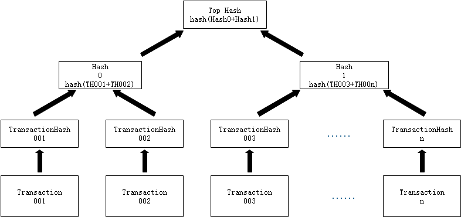

# Merkle Tree

Merkle tree is such a kind of binary tree: it's able to quickly check and induce massive data, and verify the completeness of block transaction records. NEO uses Merkle tree to construct block model. NEO's block head stores the Merkle root of all transactions within the block. Block data area stores transaction array.

Attribute of Merkle tree：

1. Merkle tree is basicly a binary tree, with all features of tree structure.
2. Merkle tree's leaf nodes' value is unit data of data set, or unit data HASH.
3. The value of a non-leaf node is based on all the leaf node values below it, and then calculated with hash method.

Transaction verification principle:

Transcation001's validity can be verified by comparing original Top Hash value with the value computed from Transcation001, Transcation002 and Hash1(The direct child of Top Hash on the right side).

## Usage Scenarios

- Builds a Merkle tree root when constructing a block header
- Verifies the block data using SPV wallets.
- As a data structure, generates a stateRoot for NEO blocks. This is used in cross-chain and light node scenarios for quickly verifying the validity of blocks.